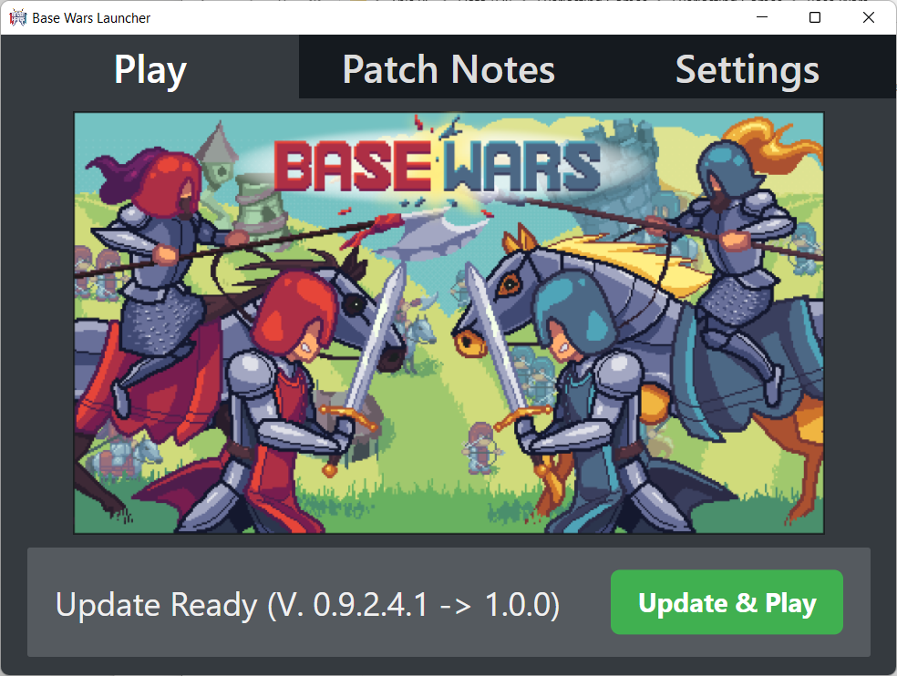
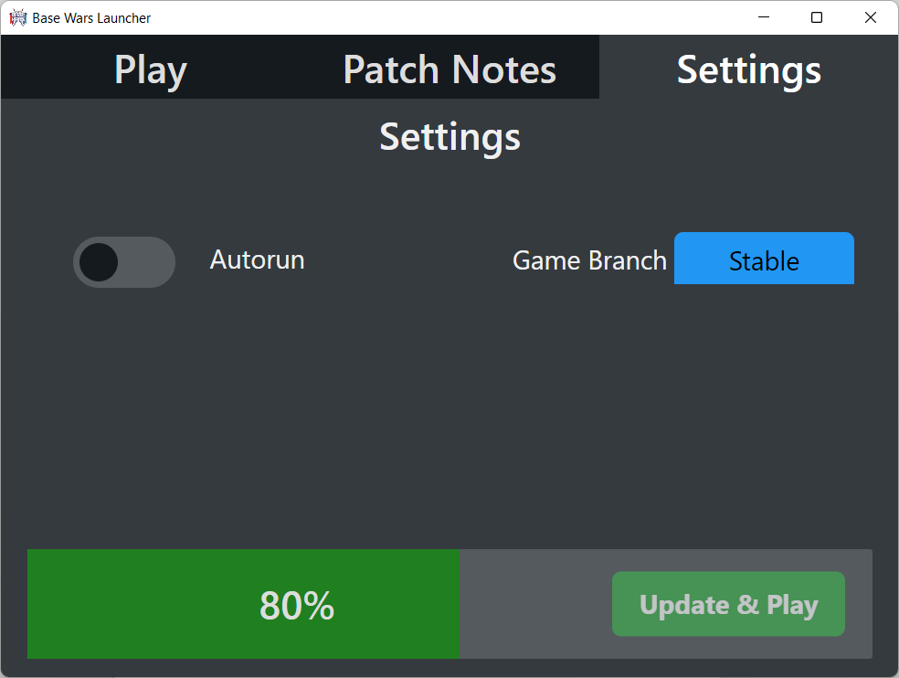

# About

Deprecated Launcher application for Base Wars.

This was used as a version management application to update and launch Base Wars before it moved to Steam.




## Usage

```
./make.sh
```
Will compile, but not work out-of-the-box;
Since publishing on Steam, the game's public build was removed.


